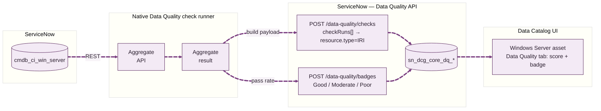

# Local Catalog: ServiceNow CMDB

Cataloging data that already lives inside the ServiceNow instance itself (CMDB). This document is scoped to CMDB only.

## Method

Catalog CMDB with the **native ServiceNow metadata collector** in Connect Hub, pointed at the instance's own URL. This is the only supported path. A collector run registers each asset in the catalog knowledge graph - it populates `iri`/`class_iri`, which is what the Data Catalog detail views, semantic search, and the Data Product "Add assets" picker all read from. Direct Table API inserts into `sn_dcg_cc_kos_*` render in list/detail views but never get an `iri`, so they are invisible to every graph-backed surface. Do not use Table API inserts for this.

## Prerequisites

- **A working MID Server.** The collector runs its collection through a MID, even when the instance catalogs its own tables. Confirm the MID is Up/validated first - a broken MID leaves the collector stuck at status `NEW`.
- **Roles on the running user** (all present on `admin` here): `df_data_steward` (create/manage data interfaces), `data_product_admin` (create/publish data products), `data_product_user` (read consumer access).
- **No zero-copy connector needed.** That is only for external sources (Snowflake, Databricks, Oracle). CMDB is native.

## Set up the collector (Connect Hub)

**All > Connect Hub > Create metadata collector**, System = **ServiceNow**, Connection type = **New connection**:

- Connection name, e.g. `ServiceNow Self`
- ServiceNow Instance URL = this instance's URL
- Authentication = username + password (basic auth)

Saving creates the standard record chain:

| Record | Table | Purpose |
|---|---|---|
| Connection & Credential Alias | `sys_alias` | ties the connection and credential together |
| HTTP Connection | `http_connection` | instance host + `https` |
| Credential | `basic_auth_credentials` | username + encrypted password |
| Metadata Collector | `sys_wdf_metadata_collector` | links the `catalog-servicenow` connector to the alias |

## Run and verify

1. On the collector, run **Connect & verify**. If it stays `NEW`, the MID is not healthy - fix that first. **Unverified beyond that:** we never exercised this button - every run in this repo was triggered directly over REST (`schedule_now`), bypassing it entirely. What it does to `collector_status` and whether it creates a scheduled job is not something we've tested. Do not assume a scheduled job appears on success - checked 2026-08-05 across all 4 collectors on this instance, only one (`Neon`, the one run manually through the UI early on) has `scheduled_job` populated; our REST-triggered ServiceNow collector is `CONNECTED` with no scheduled job at all despite a `COMPLETED` run.
2. Run a collection. Watch `sn_dcg_core_execution_run`: a good run ends `COMPLETED`; failures record an `error_message` there.
3. Confirm the assets - CMDB tables land in `sn_dcg_cc_sn_table` (technical name in `table_name`, not `name`), each with a populated `iri` (this is what distinguishes a real collector asset from a flat insert):

```
curl -u admin:<password> "https://<instance>.service-now.com/api/now/table/sn_dcg_cc_sn_table?sysparm_query=table_name=cmdb_ci_server&sysparm_fields=table_name,name,iri"
```

There is no table selection to configure. Verified 2026-08-05: the `catalog-servicenow` connector's wizard has exactly 4 fields - instance URL, username, password, and a hidden `use_mid` - no schema/table/scope filter of any kind. Unlike `catalog-oracle` or `catalog-databricks`, which do expose "schemas to collect," this connector harvests every application scope, table, field and view on the instance unconditionally (confirmed: 20,768 tables / 621,579 fields on one run). `cmdb_ci_appl`, `cmdb_ci_service`, etc. arrive automatically - there is nothing to add them to.

## Create a Data Interface, then a Data Product

Order matters: the Data Product "Add assets" step only lists **published Data Interfaces**, so build the interface first.

### Data Interface on `cmdb_ci`

1. **All > Workflow Data Fabric > Data Workbench**
2. **Create > Create data interface**
3. Basic details: interface label (e.g. `Configuration Items`), confirm application scope, **Continue**
4. Select source tables: **Add**, find `cmdb_ci` in the Data Catalog, add it, **Continue** (single table -> no join/union step)
5. Select columns: pick only what consumers need, **Continue**
6. Review the target column mapping, adjust labels/types, **Create table** (creates the Data Fabric table)
7. **Connect and verify** the source connection -> expect **Verified**
8. **Preview** the top rows to confirm the data
9. Review permissions, **Continue**. For a native table the wizard does not auto-assign read roles - a security admin adds them to the composite role (an email template is generated for this).
10. Review and finalize, **Done**

### Data Product

1. **Data Workbench > Create > Create data product**
2. Basic details: name, description, optional tags, **Continue**
3. **Add assets** -> select the `Configuration Items` interface, **Continue**
4. Review inherited permissions (set access on the interface, not here), **Continue**
5. Review, **Done** - created in **draft**
6. **Publish** to make it visible to consumers in the Data Catalog

## Optional enrichment on the collected assets

Applied by PATCH to the collector-produced table assets (`sn_dcg_cc_kos_database_table/{sys_id}`):

- **Owner / Steward** -> `admin`
- **Lifecycle status** -> `Approved` (resolves to an `sn_dcg_core_lifecycle_status` record)
- **Tags** -> create with `POST /api/sn_dcg_core/v1/catalog/tag` (new sys_id is at `result._meta.sysId`), then set the `tags` field
- **Glossary terms** -> create in `sn_dcg_core_glossary_term`; link to assets via the UI's Related Assets editor (no relationship predicate for term links exists on this instance)

## Data Quality API ingestion with Soda Core (done 2026-08-19)

Ran 16 real checks against all 4,162 live `cmdb_ci_win_server` records and pushed the results into the Data Quality API. 12 passed, 4 failed on genuine data issues, 1 not evaluated (schema baseline - normal on a first run, no history to compare against yet).

### Soda Core side

Soda Core has no direct ServiceNow connector - it needs a SQL-connectable source. Bridged via DuckDB (embedded, zero-server):

1. Pull the table via Table API, paginated (`sysparm_limit`/`sysparm_offset`, 500/page). Reference fields come back as `{link, value}` objects even without `sysparm_display_value` - flatten to the `value` (sys_id) before loading.
2. Load into a local DuckDB file with pandas (cast numeric/date columns properly - REST returns everything as strings).
   ```
   pip install soda-core-duckdb duckdb pandas
   ```
3. `configuration.yml` - one `data_source` block, `type: duckdb`, pointing at the file.
4. `checks.yml` - SodaCL checks. Mapped to the requested categories, dropped 2 that had no sensible analog for this table:
   - dropped **record-count/population reconciliation** - no second real source to reconcile against
   - dropped **quarantining data from OE/DE calculations** - no visibility into that downstream process for a server CI table
   - the other 10 categories each got 1-2 real checks (mandatory/non-null, format/regex, length, approved choice values, reference sys_id format, duplicate detection, conditional-mandatory, freshness, and a `schema:` block for drift detection)
5. Run via the Python API, not the CLI (`soda scan` wasn't on PATH):
   ```python
   from soda.scan import Scan
   scan = Scan()
   scan.set_data_source_name("cmdb")
   scan.add_configuration_yaml_file(file_path="configuration.yml")
   scan.add_sodacl_yaml_file(file_path="checks.yml")
   scan.execute()
   scan.get_scan_results()   # structured dict: per-check outcome, check_value, generated SQL
   ```

### ServiceNow API side

**Endpoints used** (base `sn_dcg_core`, all needed a `/v1/` segment not shown in `sys_ws_definition.base_uri` - same versioning quirk as the Lineage API):
- `POST /api/sn_dcg_core/v1/catalog/data-quality/checks`
- `POST /api/sn_dcg_core/v1/catalog/data-quality/badges`
- `GET /api/sn_dcg_core/v1/catalog/data-quality/logs?requestId=`

**Targeting:** `config.resource` / `resource` = `{"type": "IRI", "iri": "<table's own catalog iri>"}` - pulled once from `sn_dcg_cc_sn_table` for `cmdb_ci_win_server`, reused across all 16 `checkRuns[]` entries and the one `badges[]` entry (table-level assessment, not per-record).

**Payload per check** - `config.source: "soda"`, `config.title`, `config.query` (the real generated SQL from Soda's scan results, so the check is traceable), `config.dimension` (COMPLETENESS/VALIDITY/UNIQUENESS/CONSISTENCY/TIMELINESS per category), `result: PASS|FAIL`, `runSuccessful: true`, `evaluatedMessage` (the real finding, e.g. "98 duplicate serial number groups found").

**Badge:** one `Moderate` (12/16 pass rate - not `Good`, not `Poor`).

**Response:** both calls returned `202 Accepted`, `success: 16`/`success: 1`, `failed: 0`.

## Data Quality checks with zero data leaving ServiceNow

The Soda Core approach above pulls every row into a local DuckDB file - real CMDB field values leave the instance. This section replaces those 16 checks with checks computed entirely server-side: only a single aggregate number crosses the wire per check, never row data.



**Endpoint:** `GET /api/now/stats/{tableName}` (Aggregate API, wraps `GlideAggregate`) with `sysparm_count=true` and `sysparm_query=<encoded query>`.

Pushed 8 checks against `cmdb_ci_win_server`, same targeting/payload shape as the Soda run (`config.source: "native_stats"`, `resource.type: "IRI"`, same table IRI):

| Check | Query | Result |
|---|---|---|
| mandatory_name | `nameISEMPTY` | FAIL - 10/4162 missing |
| mandatory_opstatus | `operational_statusISEMPTY` | PASS - 10 missing (0.24%) |
| mandatory_serial | `serial_numberISEMPTY` | PASS - 324 missing (7.79%) |
| choice_opstatus | `operational_statusNOT INjavascript:[...]` | PASS - 0 invalid |
| choice_classification | `classificationNOT INjavascript:[...]` | PASS - 0 invalid |
| format_cpu_core | `cpu_core_countISNOTEMPTY^cpu_core_count<1^NQcpu_core_countISNOTEMPTY^cpu_core_count>256` | PASS - 0 out of range |
| cond_location | `operational_status=1^locationISEMPTY` | FAIL - 2710 missing location |
| freshness_updated | `sys_updated_on<javascript:gs.daysAgoStart(730)` | FAIL - 385 stale >730 days |

Badge pushed: `Moderate` (5/8 pass).

**Duplicate detection - also native, via the Aggregate API's `sysparm_group_by`/`sysparm_having`** (not just `sysparm_count`): `GET /api/now/stats/cmdb_ci_win_server?sysparm_count=true&sysparm_group_by=serial_number&sysparm_having=count^serial_number^>^1&sysparm_query=serial_numberISNOTEMPTY` returns one entry per duplicate value plus its count - confirmed 98 duplicate `serial_number` groups (matches the Soda finding exactly) and 0 duplicate `sys_id` groups. Computed and verified, not yet pushed to the API.

**Confirmed impossible natively - not a Table-API-vs-Aggregate-API gap, a language gap:** checked ServiceNow's own operator reference (`r_OpAvailableFiltersQueries.md` in the ServiceNowDocs repo). The encoded query language has no `LENGTH()` function and no regex operator (only `LIKE`/`STARTSWITH`/`ENDSWITH` substring matching) on any REST surface, Table or Aggregate. So these 6 of the original 16 checks cannot be done as a pure server-side aggregate at all - they need real field values in hand:
- `length_host_name`, `length_serial` (need `LENGTH()`)
- `format_fqdn`, `ref_manufacturer`, `ref_model`, `ref_location` (need regex)
